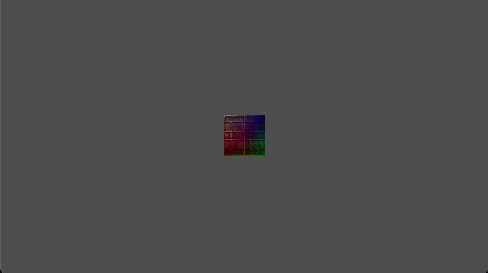

# Cruthú Lonrúil

## Basic Render Engine

A basic render engine/library written in C++17. Primarily for educational purposes and because graphics are cool.

Planned Features:
- Model Loading
- Blinn-Phong Lighting
- Splines
- Basic collision detection (both 2D and 3D)

## Style and Design Guide

User level functions (functions that are exposed to the user of the library) will adhered to the following naming convention: clNameOfFunction()

Hidden internal functions will adhere to the following naming convention: name_of_function(); 