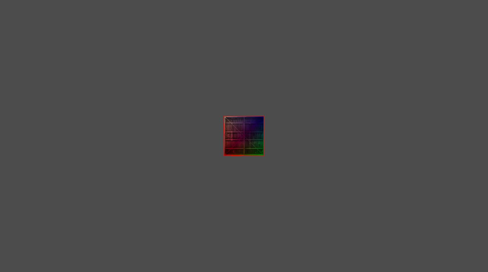
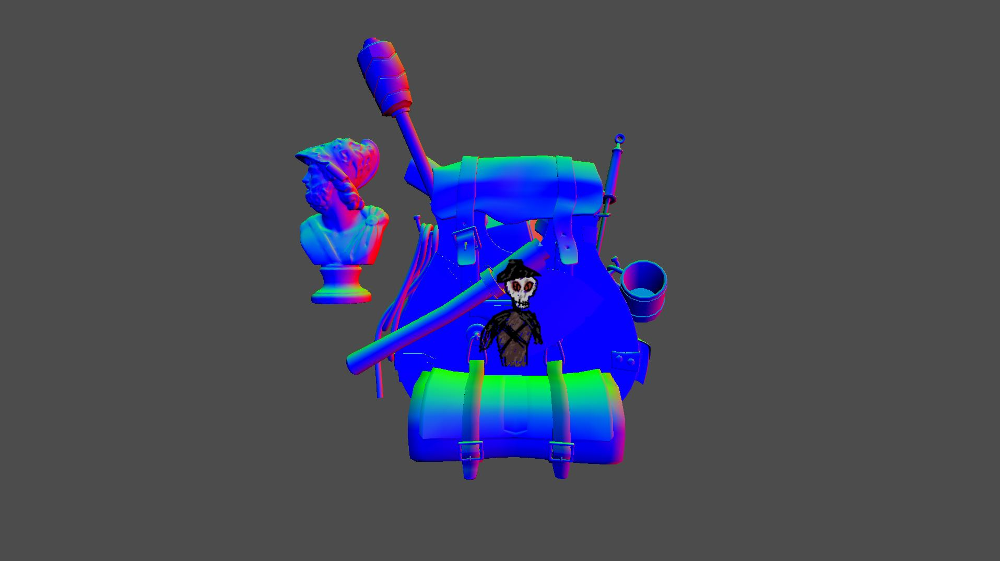
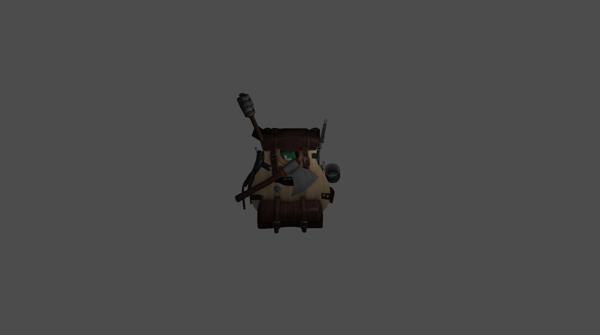

# Cruthú Lonrúil

## Basic Render Engine





A basic render engine/library written in C++17. Primarily for educational purposes and because graphics are cool.

Planned Features:
- Model Loading
- Blinn-Phong Lighting
- Splines
- Basic collision detection (both 2D and 3D)

## Style and Design Guide


## Build
To build Cruthú Lonrúil make a build directory and run the cmake file with the generator of your choosing. Then run the generator specific command or cmakes --build command.

An example using MinGW Makefiles on Window would look like this:

```
mkdir build
cd build
cmake ../ -G "MinGW Makefiles"
make
```